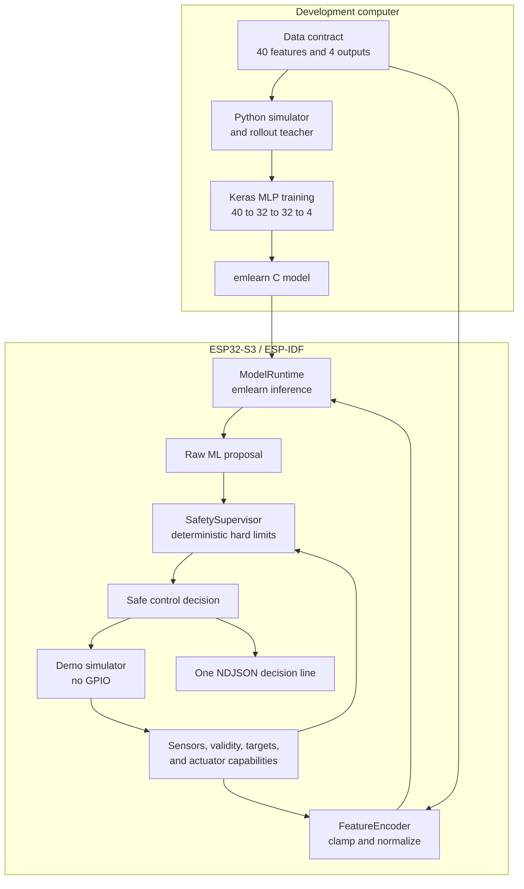

# Growbox ML Controller

Production-oriented TinyML environment-controller demo for ESP32-S3, designed for future GrowClip
Nodeflow integration.

The project trains a small neural-network controller on deterministic, physically inspired growbox
simulations, exports it to portable C with emlearn, and runs that exact generated model in a native
ESP-IDF application. A separate deterministic safety supervisor remains in control of hard limits.
The demonstration firmware only drives its local simulator: **it never configures or writes GPIO**.

> This is an engineering demo, not a calibrated physical model or a validated controller for
> unattended heaters, pumps, or other real equipment.

The long-term target is a **commercial configurable controller** (multi-zone irrigation, optional
ML, deterministic safety), not a single hobby growbox. Product scope, v2 I/O, and work order:
[docs/plan.md](docs/plan.md) (section *Wizja produktu*).

## How it works

Python runs on the development computer to create and train the model. The ESP32-S3 runs only the
exported C model, applies independent safety rules, and feeds the safe result back into a local
simulator. TensorFlow is not needed on the board.



Every control cycle follows the same five steps:

1. The demo simulator, or an external replay command, provides sensor readings, validity masks,
   targets, enclosure parameters, and actuator capabilities.
2. `FeatureEncoder` converts that state into the exact 40-element input vector. Values are clamped
   to contract ranges and normalized to `0..1`.
3. `ModelRuntime` verifies schema identity and dimensions, then runs the committed generated model.
4. `SafetySupervisor` treats model outputs as suggestions and independently enforces availability,
   temperature limits, binary dwell times, and irrigation limits.
5. Firmware logs both `raw_output` and `safe_output`. Only the safe result is applied to the demo
   simulator.

The reusable `lib/environment_control` library has no dependency on ESP-IDF, Arduino, serial I/O,
JSON, GPIO, Wi-Fi, FreeRTOS, sensor drivers, actuator drivers, or the simulator.

**Docs:** [Plan prac (v2)](docs/plan.md) · [Architecture](docs/ARCHITECTURE.md) · [I/O map](docs/IO_MAP.md) · [Contract](docs/DATA_CONTRACT.md) · [Training](docs/MODEL_PIPELINE.md)

## Firmware stack

- ESP-IDF 5.5.1 baseline in CI.
- ESP32-S3 target, C++17 application and controller components.
- ESP-IDF `json` component for the bounded NDJSON demo protocol.
- ESP-IDF UART, monotonic timer, FreeRTOS, and heap APIs.
- A narrow in-tree emlearn-compatible runtime pinned to the exact upstream revision used by the
  generated model.
- No Arduino framework and no PlatformIO firmware build.

The default profile is an ESP32-S3-DevKitC-1 with an N8 module: 8 MB quad flash and no PSRAM. An
explicit N32R16V profile is provided for modules marked `ESP32-S3-WROOM-2-N32R16V`. Do not select the
octal flash/PSRAM profile for N8 or N8R8 hardware.

## Prerequisites

- ESP-IDF 5.5.1 installed and exported into the active shell.
- CMake and a host C++17 compiler for portable tests.
- Python 3.11 and the pinned packages in `requirements-lock.txt` for training and analysis.
- A data-capable USB cable connected to the development board's USB-to-UART port.

For a standard ESP-IDF installation, activate it before running firmware commands:

```bash
. "$HOME/esp/esp-idf/export.sh"
idf.py --version
```

## Quality gate (local)

One-time setup installs pre-commit hooks and dev linters:

```bash
make setup-dev
```

| Command | When |
|---------|------|
| `make check-fast` | Lint/format + schema check (matches CI pre-commit step) |
| `make check` | Full gate: pre-commit + pre-push steps below |
| `make check-push` | pytest, host C++ tests, **idf build** (N8 gate), **clang-tidy** (lib) |
| `make idf-gate-build` | Firmware compile gate only (`build/idf-gate`, fast N8 profile) |
| `make clang-tidy-host` | Static analysis on portable controller (`lib/environment_control`) |
| `make fmt` | Auto-fix Python (ruff) and C++ (clang-format) on the tree |

On `git commit`, fast hooks run on staged files. On `git push`, `make check-push` runs
(`scripts/quality_gate_push.sh`). Requires ESP-IDF in the shell (`source export.sh`). For
`idf.py clang-check` in CI, install esp-clang once: `python $IDF_PATH/tools/idf_tools.py install esp-clang`.

Skip temporarily: `SKIP=quality-gate-push git push`, `SKIP_IDF_BUILD=1`, `SKIP_CLANG_TIDY=1`, or
`git commit --no-verify` when needed.

## Quick start

```bash
python3 -m venv .venv
source .venv/bin/activate
python -m pip install --upgrade pip
python -m pip install -r requirements-lock.txt

python -m tools.ml.pipeline --quick
cmake -S test/host -B build/host-tests
cmake --build build/host-tests --parallel
ctest --test-dir build/host-tests --output-on-failure

idf.py -B build/idf -D GROWBOX_BOARD_PROFILE=esp32s3-devkitc1-n8 build
idf.py -B build/idf -p /dev/cu.usbserial-10 flash monitor
```

Equivalent shortcuts are available through `make setup`, `make train-quick`, `make test`,
`make build`, `make flash`, and `make monitor`.

## Optional N32R16V build

Only for a module explicitly marked `ESP32-S3-WROOM-2-N32R16V`:

```bash
idf.py -B build/idf-n32r16v \
  -D "SDKCONFIG_DEFAULTS=sdkconfig.defaults.n32r16v" \
  -D GROWBOX_BOARD_PROFILE=esp32s3-devkitc1-n32r16v \
  build
```

The profile enables 32 MB octal flash and octal PSRAM. The default build remains the safer N8/no-
PSRAM configuration.

## Project layout

```text
components/emlearn_runtime/       minimal pinned inference runtime
lib/environment_control/          portable controller ESP-IDF component and package
src/                              ESP-IDF application component
src/demo/                         simulator and bounded UART/JSON adapter
schemas/                          versioned model/controller contract
tools/ml/                         simulation, training, export, parity checks
tools/serial/                     capture and replay tools
test/host/                        CMake/CTest harness
test/test_environment_controller/ portable controller test cases
tests/                            Python tests and golden fixtures
```

The root `CMakeLists.txt` registers `src/` and `lib/environment_control` as ESP-IDF components.
`library.json` remains in the portable library because LiteGraph is still expected to consume an
immutable release of that library through its PlatformIO build.

## Training and export

The quick profile is for CI and smoke tests only. Production training waits for contract v2 — see
[plan.md](docs/plan.md).

```bash
make train-quick   # CI / smoke
make train-full    # after v2 contract is complete
```

See [Model pipeline](docs/MODEL_PIPELINE.md).

## Build, flash, and monitor

```bash
idf.py -B build/idf build
idf.py -B build/idf -p /dev/cu.usbserial-10 flash
idf.py -B build/idf -p /dev/cu.usbserial-10 monitor
```

On boot, firmware emits one startup NDJSON object containing framework, ESP-IDF, schema, model, and
board-profile identity. It then emits one decision object per step. One wall-clock second represents
a ten-second simulation step.

## Serial protocol and scenarios

Commands are one JSON object per line. Supported operations remain:

- `status`
- `reset`
- `seed`
- `pause` and `resume`
- `step`
- `target`
- `load_scenario`
- `mode` with `closed_loop` or `replay`

The ESP-IDF UART adapter uses a bounded 4096-byte line buffer and returns structured errors for
oversized, malformed, or unsupported input.

Replay a committed scenario and save the bidirectional session:

```bash
python -m tools.serial.replay \
  --port /dev/cu.usbserial-10 \
  --scenario examples/scenarios/nominal.jsonl \
  --output logs/nominal-session.ndjson
```

Capture autonomous output until interrupted:

```bash
python -m tools.serial.capture \
  --port /dev/cu.usbserial-10 \
  --baud 115200 \
  --output logs/closed-loop.ndjson
```

Analyse a capture and optionally export decision rows to CSV:

```bash
python -m tools.analysis.report logs/closed-loop.ndjson --csv logs/closed-loop.csv
```

## Contract and availability

`schemas/environment-controller-v1.json` is the single source of truth for field names, order,
units, ranges, defaults, and model inputs/outputs. Generation embeds its canonical short hash in the
C++ schema metadata, model, manifest, firmware, and startup logs. Firmware rejects a model built for
a different contract identity.

After changing the contract, regenerate its C++ view before retraining:

```bash
python tools/schema/generate_environment_schema.py
python -m tools.ml.pipeline --quick
```

Each sensor has an independent validity mask. A missing actuator is represented by
`available: false` and zero maximum capability. The encoder exposes this to the model, while the
safety supervisor independently forces that actuator's final output to zero. See
[Data contract](docs/DATA_CONTRACT.md).

## Tests and CI

```bash
python -m pytest
python tools/schema/generate_environment_schema.py --check
python -m tools.ml.pipeline --quick --check-generated
cmake -S test/host -B build/host-tests
cmake --build build/host-tests --parallel
ctest --test-dir build/host-tests --output-on-failure
idf.py -B build/idf build
```

CI runs Python validation, deterministic model regeneration, compiled-C golden-vector parity tests,
and an ESP-IDF 5.5.1 ESP32-S3 firmware build. No physical board is required for CI.

## Demo limitations

- The v1 simulator uses simplified physics; **v2** targets training-grade coupled growbox thermodynamics ([plan.md](docs/plan.md) → *Symulator — termodynamika growboxa*).
- Synthetic training cannot establish real-world performance or safety.
- The v1 teacher is a short-horizon deterministic search, not model-predictive control or RL.
- The exported float model favors a transparent demonstration over aggressive quantization.
- No physical sensors or actuators are connected, calibrated, or driven.
- Flashing and serial smoke testing require a locally attached board.

## GrowClip Nodeflow path

A future integration with `MichalMatu/esp32s3_LiteGraph` will replace the dummy simulator with a
provider adapter and pass safe decisions to a typed actuator bridge. The encoder, runtime,
supervisor, schema identity checks, and fixed-size public types should move unchanged. No integration
with that repository is implemented here. See [Porting to LiteGraph](docs/PORTING_TO_LITEGRAPH.md).

## License

Released under the [MIT License](LICENSE). The in-tree emlearn runtime subset retains its upstream
MIT notice in `components/emlearn_runtime/LICENSE`.
