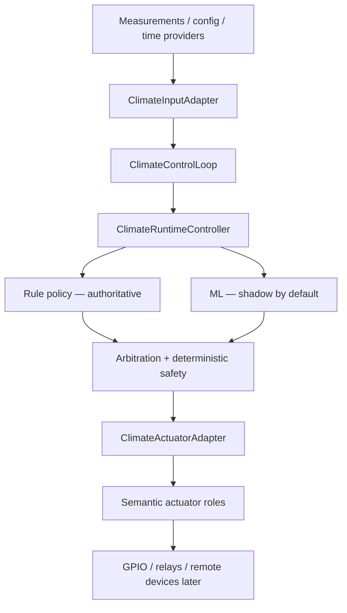

# Growbox ML Controller

ESP32-S3 environment-control research and product-development repository combining a portable C++ controller, TinyML inference, deterministic safety, simulation/calibration tooling, a scientific 3D twin, and browser-based hardware configuration.

> **Current controller status:** Stage28C and the pre-Stage28D golden gate are complete; Stage28D is in progress. A bounded primary-serial service console now provides read-only diagnostics plus explicitly manual RF433 service commands while the climate runtime remains fake-locked for unattended outputs. See [docs/CURRENT_STATUS.md](docs/CURRENT_STATUS.md), [docs/RF433_DEVICE_CODES.md](docs/RF433_DEVICE_CODES.md) and [docs/PRESTAGE28D_GOLDEN_CHECKPOINT.md](docs/PRESTAGE28D_GOLDEN_CHECKPOINT.md).

## Live demos

- **Interactive 3D chamber configurator:** https://michalmatu.github.io/growbox-ml-controller/chamber-3d
- **Hardware / JSON configurator:** https://michalmatu.github.io/growbox-ml-controller/

The currently deployed Pages build still comes from the preserved configurator line. It will not be replaced from this integration branch until firmware, simulator/twin, frontend and deployment checks all pass.

## What this repository contains

### ESP32-S3 controller and firmware

The preserved ESP-IDF demonstration still uses the legacy `EnvironmentController` plus local simulator/UART protocol. In parallel, the current climate-v6 C++ runtime (`ClimateRuntimeController` + `ClimateControlLoop`) is host/HIL tested and compiled into the real ESP32-S3 firmware build. It does **not** drive real GPIO loads yet.

The portable `lib/environment_control` layer is intentionally independent of ESP-IDF, Arduino, serial I/O, JSON, GPIO, Wi-Fi, FreeRTOS, sensor drivers and the simulator.

**Contract boundary:** the preserved legacy demo/wire path still uses root schema v4, while all new climate-controller runtime work targets `schemas/environment-controller.v6.json`: **44 runtime-observable features and 6 ML-controlled climate outputs**. The contracts are intentionally not silently mixed.

### ML pipeline and simulation

Python tooling generates deterministic synthetic scenarios, trains the model, exports it through the emlearn-compatible C runtime, checks generated artifacts and validates parity against golden vectors.

The simulator line also contains calibration, deviations/foresight work and physically inspired chamber/pot models. These tools are research/engineering aids, not a calibrated real-world safety model.

### Scientific 3D twin

`tools/ml/twin/` provides a PyVista visual layer over the simulator, with `GrowboxProfile`, chamber/pot geometry, hardware profiles, camera/HUD tooling, live interaction and tests. The scientific twin intentionally visualizes a lumped model rather than pretending to be CFD.

See [docs/simulator/TWIN_VIEW.md](docs/simulator/TWIN_VIEW.md) and [docs/simulator/CALIBRATION.md](docs/simulator/CALIBRATION.md).

### Browser configurator and chamber 3D

`web/` is a React + TypeScript + Vite application. It contains:

- schema-driven hardware/JSON configuration at `/`
- interactive React Three Fiber chamber configuration at `/chamber-3d`
- Three.js / React Three Fiber geometry for enclosure, lighting, pots and fans
- tests, type checking, linting and a production build gate

The browser configurator has evolved beyond the current firmware contract and therefore carries its own explicit bundled schema at `web/schema/environment-controller.v5.json`.

**Web configurator contract:** **schema v5: up to 9 pot slots, 228 model features and 25 outputs**.

The v4 firmware and v5 browser contract are deliberately kept separate during convergence. This is an architectural migration boundary, not something to silently reconcile as repository cleanup.


## Control path


```mermaid
flowchart TB
    Providers["Measurements / config / time providers"] --> InputAdapter["ClimateInputAdapter"]
    InputAdapter --> Loop["ClimateControlLoop"]
    Loop --> Runtime["ClimateRuntimeController"]
    Runtime --> Rule["Rule policy — authoritative"]
    Runtime --> ML["ML — shadow by default"]
    Rule --> Arb["Arbitration + deterministic safety"]
    ML --> Arb
    Arb --> Sink["ClimateActuatorAdapter"]
    Sink --> Roles["Semantic actuator roles"]
    Roles --> Hardware["GPIO / relays / remote devices later"]
```

The legacy simulator/serial demo remains available while this climate-v6 application path is being
integrated. See [docs/ARCHITECTURE.md](docs/ARCHITECTURE.md).

## Firmware stack

- ESP-IDF 5.5.4 baseline in CI
- ESP32-S3, C++17
- CMake / CTest portable host tests
- emlearn-compatible generated C inference
- deterministic safety supervisor
- ESP-IDF UART, timers, FreeRTOS, heap diagnostics and JSON component
- clang-tidy / clang-format / pre-commit quality gates

Default CI firmware profile: ESP32-S3-DevKitC-1 N8 (8 MB quad flash, no PSRAM). An explicit N32R16V profile is also retained for compatible hardware.

## Web stack

- React 19
- TypeScript
- Vite
- Three.js
- React Three Fiber / drei
- Tailwind CSS / shadcn UI
- Vitest / ESLint / typecheck

## Project layout

```text
components/emlearn_runtime/       pinned inference runtime
config/idf/                       ESP-IDF board profiles
docs/                             architecture, contracts, simulator and integration docs
examples/                         scenarios / examples
lib/environment_control/          portable C++ controller
profiles/                         saved GrowboxProfile examples
schemas/                          active firmware/controller contract (v4)
scripts/                          CI, IDF and helper scripts
src/                              ESP-IDF demo application
test/host/                        portable C++ CMake/CTest suite
tests/                            Python simulator / ML / profile / twin tests
tools/ml/                         simulation, training, calibration, analysis and twin
tools/panel/                      local board control/diagnostic panel
tools/serial/                     capture and replay
web/                              browser configurator + React Three Fiber chamber 3D
web/schema/                       explicit browser-side v5 contract snapshot
```

More detail: [docs/PROJECT_LAYOUT.md](docs/PROJECT_LAYOUT.md).

## Quick start — firmware / ML / host tests

```bash
python3 -m venv .venv
source .venv/bin/activate
python -m pip install --upgrade pip
python -m pip install -r requirements-lock.txt

python -m tools.ml.pipeline --quick
cmake -S test/host -B build/host-tests
cmake --build build/host-tests --parallel
ctest --test-dir build/host-tests --output-on-failure

idf.py -B build/idf -D GROWBOX_BOARD_PROFILE=esp32s3-devkitc1-n8 build
```

## Quick start — scientific twin

PyVista is optional so the default firmware/ML environment does not require the GUI stack.

```bash
pip install -e '.[twin]'
python -m tools.ml.twin_view --live
```

A saved profile can be loaded with:

```bash
python -m tools.ml.twin_view --live --profile profiles/example-single-pot.json
```

## Quick start — browser tools

Requires Node.js 22 and pnpm 11.10.0.

```bash
corepack enable
corepack prepare pnpm@11.10.0 --activate
pnpm --dir web install --frozen-lockfile
pnpm --dir web dev
```

Production gate:

```bash
pnpm --dir web typecheck
pnpm --dir web lint
pnpm --dir web test
pnpm --dir web build
```

## CI

The convergence branch validates the product layers independently:

1. Python / host C++ / generated-artifact / clang-tidy checks.
2. ESP-IDF 5.5.4 ESP32-S3 firmware build and clang-check.
3. Browser typecheck, lint, tests and production build.

The separate gates are intentional: a frontend experiment must not silently redefine the firmware contract, and firmware changes must not silently break the browser tooling.

## Serial demo protocol

The ESP-IDF demo accepts one JSON command per line, including `status`, `reset`, `seed`, `pause`, `resume`, `step`, `target`, `load_scenario` and `mode` (`closed_loop` or `replay`). The UART adapter uses a bounded line buffer and returns structured errors for malformed or unsupported input.

Example replay:

```bash
python -m tools.serial.replay \
  --port /dev/cu.usbserial-10 \
  --scenario examples/scenarios/nominal.jsonl \
  --output logs/nominal-session.ndjson
```

## Important limitations

- Synthetic training does not establish real-world control performance or hardware safety.
- The simulator is still being calibrated and should not be treated as a validated physical model.
- The scientific 3D twin is a visualization of a lumped model, not CFD.
- The demo firmware does not connect calibrated physical sensors/actuators or drive production loads.
- The v4 firmware contract and v5 browser configurator contract are not yet a single production contract.

## GrowClip integration path

A future integration with the private GrowClip / LiteGraph firmware is intended to replace the demo provider with a device adapter while preserving the portable encoder/runtime/safety boundary. See [docs/PORTING_TO_LITEGRAPH.md](docs/PORTING_TO_LITEGRAPH.md).

## Data preservation and convergence

No source branch is considered disposable merely because its code has been copied into this branch. Before deleting any historical/product branch, the convergence checklist requires successful firmware, host, Python, frontend and Pages validation plus confirmation that no unique docs, profiles, calibration data, tests or experiments remain only on the old branch.

The exact snapshot branches and deletion criteria are documented in [docs/INTEGRATION_CONVERGENCE.md](docs/INTEGRATION_CONVERGENCE.md).

## License

Released under the [MIT License](LICENSE). The in-tree emlearn runtime subset retains its upstream MIT notice in `components/emlearn_runtime/LICENSE`.
