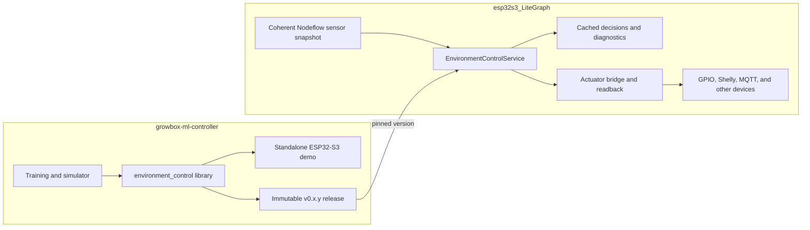

# GrowClip Nodeflow integration strategy

## Decision

Keep `growbox-ml-controller` as an independent upstream project. It is the canonical source for the
portable controller, data contract, generated model, training pipeline, simulator, tests, and the
standalone ESP32-S3 demo.

Treat `esp32s3_LiteGraph` as a versioned consumer. It owns the Nodeflow integration, device
configuration, scheduling, physical actuator dispatch, arbitration, persistence, UI, and telemetry.
The repositories may evolve independently as long as their boundary is explicit and versioned.

Do not merge the repositories, copy individual controller sources manually, or maintain a second
editable copy of the generated model in LiteGraph.



The dependency arrow points in one direction: LiteGraph depends on a released controller package.
The portable controller never depends on LiteGraph, Arduino, FreeRTOS, GPIO, networking, or a
specific sensor or actuator.

## Ownership boundary

| `growbox-ml-controller` owns | `esp32s3_LiteGraph` owns |
| --- | --- |
| Input, parameter, and output schema | Mapping Nodeflow providers to `ControllerInput` |
| Feature ordering and `FeatureEncoder` | One coherent snapshot and measurement freshness |
| Generated model and inference runtime | Controller lifecycle and scheduling |
| `SafetySupervisor` policy | Configuration and persistence |
| Training pipeline and simulator | Device drivers and hardware interlocks |
| Golden vectors and parity tests | Action arbitration and physical dispatch |
| Model/schema metadata | Readback of actually applied values |
| Standalone reference firmware | UI, logs, diagnostics, and telemetry transport |

The standalone demo must use exactly the same public controller library that LiteGraph consumes.
It is a reference adapter, not a second implementation.

## Versioned package model

The releasable unit is `lib/environment_control`, not the repository root. Its `library.json` is
nested in that directory, while PlatformIO expects a library manifest at the package root. Create
the artifact with:

```bash
pio pkg pack lib/environment_control
```

Do not currently use the complete Git repository URL directly as a PlatformIO library dependency.
Either publish the packed library as an immutable release artifact or later add a deliberately
designed root package manifest with restrictive export rules. See the PlatformIO documentation for
[creating libraries](https://docs.platformio.org/en/latest/librarymanager/creating.html),
[`pio pkg pack`](https://docs.platformio.org/en/latest/core/userguide/pkg/cmd_pack.html), and
[`lib_deps`](https://docs.platformio.org/en/stable/projectconf/sections/env/options/library/lib_deps.html).

For LiteGraph, the preferred committed integration is a vendored snapshot of an upstream release:

```text
esp32s3_LiteGraph/
└── lib/
    └── thirdparty/
        ├── environment_control/
        │   ├── library.json
        │   ├── UPSTREAM.md
        │   └── src/
        └── emlearn/
```

`UPSTREAM.md` should record the upstream repository URL, release tag, commit SHA, artifact checksum,
license, and import date. Files in the snapshot must not be edited downstream. Upgrade them by
importing and testing a new release in a dedicated commit.

The emlearn runtime must also be reproducible. LiteGraph should either vendor the exact compatible
revision or explicitly accept the controller package's pinned transitive Git dependency. Vendoring
is preferable when firmware builds are expected to work without network access.

For local development only, an ignored PlatformIO configuration may use a `symlink://` dependency
pointing to `growbox-ml-controller/lib/environment_control`. Never commit an absolute developer
machine path. Release and CI builds must use the same immutable version.

Avoid Git submodules and manual copy-and-paste updates. A submodule would pull the entire demo and ML
toolchain into LiteGraph, and a copied editable tree would create two sources of truth.

## Integration components in LiteGraph

The controller is orchestration: it reads several inputs, keeps temporal safety state, and emits
multiple dynamic outputs. It should not be forced into a sensor provider or action handler alone.
Use three small integration components.

### `EnvironmentControlService`

This service owns the only `EnvironmentController` instance and:

1. obtains one coherent sensor snapshot;
2. maps configuration, targets, capabilities, validity, and the previous applied state;
3. calls `EnvironmentController::process()` exactly once per scheduled cycle;
4. serializes inference calls;
5. caches the result and diagnostics;
6. optionally passes the safe decision to the actuator bridge.

Use a monotonic timestamp for dwell and irrigation timing. Do not use wall-clock time. The current
inference runtime uses shared working buffers, so it must not be called concurrently.

### `EnvironmentControlProvider`

This provider exposes cached raw decisions, safe decisions, diagnostics, model/schema metadata, and
decision age to Nodeflow. Reading a provider value must never trigger another inference. Otherwise a
single graph evaluation could advance the controller state several times.

### `GrowboxActuatorBridge`

This typed bridge accepts `SafeControlDecision`, maps normalized outputs to configured physical
devices, and returns the values that were actually applied. The returned state becomes
`PreviousControlState` on the next controller cycle.

The bridge must report at least:

- requested normalized value;
- applied normalized value;
- success or rejection;
- rejection or clamping reason;
- actuator identifier;
- timestamp.

Do not manufacture an artificial Nodeflow `ActionContext` merely to call the current
`ActionRegistry`. Its existing contract is centered on a static rule action and success/failure; it
does not represent four dynamic normalized controller outputs or return their applied values. Add a
canonical typed command/readback boundary first, then connect it to registered device actions.

## Planned data mapping

| Portable interface | LiteGraph role |
| --- | --- |
| `SensorState` and `SensorValidity` | Coherent sensor-provider snapshot with freshness |
| `EnvironmentConfig` and `CultivationConfig` | Persisted node or graph configuration |
| `ActuatorCapabilities` | Configured and discovered output capabilities |
| `ControlTargets` | User or automation setpoints |
| `PreviousControlState` | Values confirmed by the actuator bridge |
| `EnvironmentController::process()` | One serialized scheduled evaluation |
| `RawControlDecision` | Shadow-mode output and diagnostics |
| `SafeControlDecision` | Input to the typed actuator bridge |
| `ControllerDiagnostics` | Cached structured Nodeflow telemetry |

## Input, output, and parameter contract

The field list does not need to remain unchanged forever. It must instead be explicit and versioned.
Maintain three separate identities:

1. **Library version** — SemVer for the public C++ package.
2. **Schema version and hash** — field names, meaning, units, order, ranges, and defaults.
3. **Model version and hash** — generated weights and model-specific metadata.

A weight-only retraining with an unchanged API and schema normally produces a patch release. A
change to feature order, units, semantics, validity handling, or output order requires a new schema
identity, retraining, parity tests, and a coordinated LiteGraph dependency update. During the `0.x`
phase, incompatible public API changes require at least a minor release. After `1.0`, use a major
release.

LiteGraph must reject a controller package, persisted configuration, or trace whose expected schema
version/hash does not match. Never guess missing fields or silently reinterpret an older contract.

## Delivery sequence

### Phase 1: stabilize the upstream library

1. Keep developing and testing the standalone project.
2. Freeze the smallest useful public API around `ControllerInput`, `ControllerOutput`, `process()`,
   `resetSafetyState()`, and version metadata.
3. Verify that the packed artifact contains only the portable library and required generated files.
4. Add an external consumer smoke test using LiteGraph's PlatformIO platform and Arduino core.
5. Tag the tested immutable release, initially `v0.1.0` if its behavior is accepted.

### Phase 2: compile-only LiteGraph integration

1. Start in a clean branch or worktree after unrelated LiteGraph changes are settled.
2. Import the exact upstream release and its reproducible emlearn dependency.
3. Add the controller service and input mapping without dispatching any actuator command.
4. Build host tests and the relevant ESP32-S3 firmware environments.

### Phase 3: shadow mode

Run real Nodeflow sensor snapshots through the controller, but only record decisions and diagnostics.
Replay captured traces on the host and compare them with the standalone implementation. Measure
latency, memory use, invalid-sensor behavior, and decision stability.

### Phase 4: controlled actuator rollout

1. Define ownership and arbitration when ML and ordinary Nodeflow rules target the same device.
2. Add the typed actuator bridge and readback.
3. Enable one actuator at a time with physical limits and hardware interlocks.
4. Verify emergency behavior, stale/missing sensor handling, dwell times, irrigation limits, and
   restart recovery.
5. Keep rollback simple by retaining the previously pinned package release.

### Phase 5: Nodeflow product integration

Only after the runtime contract is proven should LiteGraph add the controller node, UI forms,
converter/parser changes, validation, persistence, telemetry presentation, and end-to-end tests.
Update every layer of that contract together.

## Release gate

Do not enable real actuators until all of the following are true:

- the package installs in an external minimal PlatformIO consumer;
- native controller tests and golden-vector parity tests pass;
- the LiteGraph host and firmware builds pass with the pinned artifact;
- one controller invocation occurs per intended cycle;
- input freshness and validity fail closed;
- commands are clamped to configured capabilities;
- actual applied values feed the next `PreviousControlState`;
- model, schema, and library metadata are logged and validated;
- arbitration with ordinary Nodeflow actions is deterministic;
- physical interlocks remain effective independently of the ML model;
- shadow-mode traces have been reviewed for the target growbox.

## Immediate next action

Continue standalone development and make `lib/environment_control` release-ready. The next concrete
milestone is a tested `v0.1.0` package plus an external consumer smoke test. This work does not
require modifying LiteGraph and does not block later Nodeflow integration.
