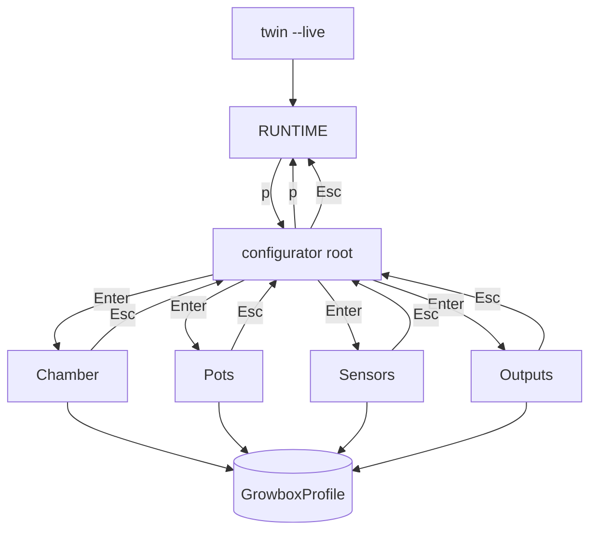

# Scientific 3D twin view (PyVista)

**Not a game. Not CFD.** A visual layer on top of the existing lumped growbox simulator.

| Layer | Role |
|-------|------|
| `tools/ml/simulator.py` | Physics (Van Henten + pots) |
| `tools/ml/twin/` | Twin package (scene + PyVista render) |
| `tools/ml/twin/scene.py` | Geometry + exchange glyphs (no PyVista) |
| `tools/ml/twin/hud.py` | HUD tables |
| `tools/ml/twin/meshes.py` | Chamber / pots / ports / arrows |
| `tools/ml/twin/camera.py` | Camera presets + trackball |
| `tools/ml/twin/plotter.py` | Background, stereo guard, plotter setup |
| `tools/ml/twin/live.py` | Snapshot / rollout / live loop |
| `tools/ml/profile.py` | **GrowboxProfile** — hardware profile (chamber/pots/sensors/outputs) |
| `profiles/*.json` | Saved profiles (example: `example-single-pot.json`) |
| `tools/ml/twin/config.py` | Twin keyboard editor: subsections **chamber** / **pots** |
| `tools/ml/twin/cli.py` | argparse + main |
| `tools/ml/twin_view.py` | Thin CLI re-export (`python -m tools.ml.twin_view`) |
| `tools/ml/twin_scene.py` | Thin re-export of `twin.scene` (compat) |

## What you see

- **Chamber** — single **white wireframe** only (no solid fill; no T/RH color mapping)
- **Pots** — fixed brown cylinder; one active pot is **centered**
- **Climate** — numbers only in the **parameters** HUD table
- **INLET / OUTLET** — two round rings on opposite walls
- **Arrows** — at most two small previews when fan is ON (not a flow field)

No temperature/humidity false-color on geometry (removed: it caused purple wash + confusion).

**Walls vs ports (physics honesty):**

| Through walls | Through inlet / outlet |
|---------------|-------------------------|
| Heat conduction / insulation (`heat_loss`, thermal mass) | **Air** exchange (fan + openings) |
| No bulk airflow drawn as wall arrows | Arrows only when fan drives ports |

Small seal leaks may exist in the ODE (`air_leak_rate_ach`) but are **not** visualized as “air through walls”.

## Install

PyVista is an **optional** dependency (keeps default CI light):

```bash
pip install pyvista
# or from project root:
pip install -e '.[twin]'
```

Headless screenshot may need a virtual framebuffer on Linux (`xvfb-run`) or `PYVISTA_OFF_SCREEN=true`.

## Commands

```bash
# Summary only (no GUI, no PyVista needed for twin_scene tests)
python -m tools.ml.twin_view --steps 30 --fan 0.8 --heater 0.2

# Offline PNG
python -m tools.ml.twin_view --steps 40 --fan 1 --outside-temperature-c 8 \
  --screenshot build/twin-fan.png

# Interactive window after a rollout
python -m tools.ml.twin_view --steps 20 --heater 1 --interactive

# Live 3D (keyboard only — VTK sliders crash on some macOS builds)
python -m tools.ml.twin_view --live

# Load a saved GrowboxProfile into live / rollout
python -m tools.ml.twin_view --live --profile profiles/example-single-pot.json
```

### Menu map (live twin) — variant A

```text
python -m tools.ml.twin_view --live
│
├─ RUNTIME  (default)
│    p ──────────────────────────────┐
│                                    ▼
└─ CONFIGURATOR root  (EN labels)
     ┌────────────────────────┐
     │ configurator           │
     │ > Chamber              │  j/k select
     │   Pots                 │  Enter / = open
     │   Sensors              │  Esc / p exit → RUNTIME
     │   Outputs              │
     └────────────────────────┘
              │ Enter
     ┌────────┼────────┬────────────┐
     ▼        ▼        ▼            ▼
  Chamber   Pots    Sensors      Outputs
  volume    active  air T ON/off heater ON/off
  thermal   pot L   …            fan …
  heat loss water   pot soil …   irr pot N …
  leak ACH          lights       heat mat …
     │        │        │            │
     Esc ─────┴────────┴────────────┘ → back to root
     p → always full exit to RUNTIME
```



### Live keys

| Key | Action |
|-----|--------|
| `s` / space | step simulator (10 s) |
| `r` | reset |
| `1` / `2` | heater on / off |
| `3` / `4` | fan on / off |
| `5` / `6` | humidifier on / off |
| `h` / `H` | heater ±0.25 |
| `f` / `F` | fan ±0.25 |
| `u` / `U` | humidifier ±0.25 |
| `7` / `c` | **HOME** camera (default product angle) |
| `8` | camera top |
| `9` | camera front |
| `0` | camera side |
| `i` | pure isometric |
| `m` | force mono (if VTK stereo left purple) |
| `p` | **configurator** — root menu (Chamber / Pots / Sensors / Outputs) |
| mouse drag | rotate / pan / zoom (trackball) |

### Configurator (`p`) — variant A

Keyboard-only. Edits a **GrowboxProfile** (board payload + future training).

| Context | Key | Action |
|---------|-----|--------|
| root | `j` / `k` | select section |
| root | `Enter` / `=` / `→` | open section |
| root | `Esc` / `p` | exit to RUNTIME |
| section | `j` / `k` | next / prev field |
| section numeric | `-` / `=` / `[` / `]` | value step |
| section flags | `-` / `=` / `space` | toggle ON/off |
| section | `Esc` | back to root menu |
| any | `p` | full exit to RUNTIME |

**Chamber** — volume, thermal mass, heat loss, leak ACH
**Pots** — active pots (0–4, prefix slots), shared pot volume L, water cap, transpiration, irr flow/pulse/interval, mat max W, soil targets
**Sensors** — validity toggles (air/out/CO₂/nutrient/lights schedule + P1–P4 soil; soil rows no-op when pot inactive)
**Outputs** — available **and limits**: heater W/eff, fan m³/h + min cmd, humid g/h, dehum, cooler, CO₂ dose/pulse, nutrient heat, lights heat W, irr/mat per pot ON/off

Geometry keys (`volume`, `active pots`, `pot volume`) trigger a hard scene rebuild.

**MVP limits (honest):** shared pot template (same L for all active pots); active pots are prefix `0..N-1` (not arbitrary subsets); no save-to-disk from keyboard (use `save_profile` / edit JSON).

Python API:

```python
from tools.ml.profile import default_profile, load_profile, profile_to_scenario, profile_to_payload

profile = load_profile("profiles/example-single-pot.json")
scenario = profile_to_scenario(profile, seed=0)
payload = profile_to_payload(profile)  # panel / board shape (no actuators.lights — non-ML)
```

## Honest limits

1. Single air node → one chamber color, not a T field on a mesh.
2. Fan glyphs are through-flow heuristics along +X, not measured duct geometry.
3. Van Henten path uses fan m³/h, heat loss W/K, residual cooler watts, and thermal mass (scaled).
4. For a true digital twin: calibrate scalars first ([CALIBRATION.md](CALIBRATION.md)), then drive this view from live sensors.

## Related

- Physics: [PHYSICS_SCOPE.md](PHYSICS_SCOPE.md), [VALIDATION.md](VALIDATION.md)
- Deviations / foresight: `tools/ml/deviations.py`, `foresight.py`
